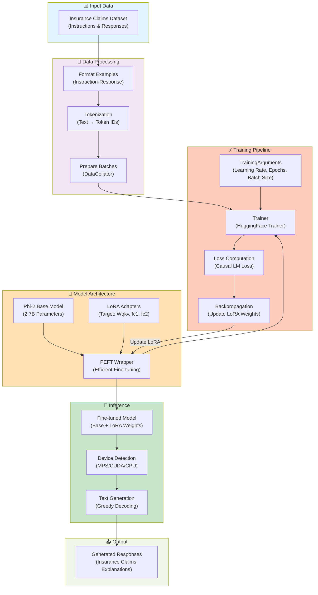

# Architecture Diagram: Phi-2 Insurance Domain Fine-Tuning

This diagram illustrates the complete pipeline for fine-tuning Microsoft's Phi-2 model on insurance claims data using LoRA (Low-Rank Adaptation).

## System Architecture

## Component Descriptions

### 📊 Input Data
- **Insurance Claims Dataset**: Contains instruction-response pairs for insurance-related queries
- Examples: Claim denials, medical appeals, authorization requirements

### 🔄 Data Processing
1. **Format Examples**: Structure data as `### Instruction: ... ### Response: ...`
2. **Tokenization**: Convert text to token IDs using the Phi-2 tokenizer (max 512 tokens)
3. **Prepare Batches**: Use DataCollator to create batches for training

### 🤖 Model Architecture
- **Phi-2 Base Model**: 2.7B parameter causal language model from Microsoft
- **LoRA Adapters**: Low-rank matrices added to specific layers (Wqkv, fc1, fc2)
- **PEFT Wrapper**: Combines base model with LoRA for efficient fine-tuning

### ⚡ Training Pipeline
1. **TrainingArguments**: Configure learning rate (2e-4), epochs (3), batch size (1)
2. **Trainer**: HuggingFace's Trainer class manages the training loop
3. **Loss Computation**: Calculate causal language modeling loss
4. **Backpropagation**: Update only LoRA weights (~0.1% of model parameters)

### 🔮 Inference
1. **Device Detection**: Automatically selects MPS (Mac), CUDA (GPU), or CPU
2. **Text Generation**: Uses greedy decoding (deterministic, non-sampling)
3. **Output Generation**: Produces responses for insurance-related queries

### 📤 Output
- **Generated Responses**: Domain-specific explanations and appeals for insurance claims

## Key Features

✅ **Parameter Efficient**: LoRA reduces trainable parameters from 2.7B to ~1M  
✅ **Multi-Device Support**: Works on Mac (MPS), NVIDIA GPU (CUDA), and CPU  
✅ **Domain Adapted**: Fine-tuned specifically for insurance claims processing  
✅ **Fast Inference**: Minimal memory overhead during text generation  
✅ **Reproducible**: Clear configuration and standardized training pipeline  

## Files Reference

- **Notebook**: `Notebooks/test_notebook.ipynb` - Complete implementation
- **Requirements**: `requirements.txt` - All dependencies
- **README**: `README.md` - Project documentation
